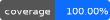

# SVGCreator

 
  
 
 
  
 
----------
## Overview

This package can compose vectorial graphics and generate SVG files.

It provides several classes that can compose an XML document with the structure of an SVG document with several types of vectorial graphic elements.
The main SVG class can return a string with the SVG document in XML format to a string or a file.

Currently it supports the SVG vectorial graphic elements:
- Core elements
  - Comments
  - Groups
  - Images
  - Symbols
- Text elements
  - Text
  - Text path
- Shapes
  - Circle
  - Ellipse
  - Line
  - Path
  - Poligon
  - Polyline
  - Rectangle
- Filter
  - Blend filter
  - Drop shadow filter
  - Flood filter
  - Gaussian filter
  - Offset filter 
- Gradients
  - Linear gradient
  - Stop gradient
  - Radial gradient
- Marker
  - ArrowMarker
  - BasicMarker
- Extended shapes
  - Blockarrow
  - Star
  

## Usage

For usage see the several examples in the './examples' directory

## Documentation

A full documentation can be found in the Wiki at 
[GitHub.com](https://github.com/Stefanius67/SVGCreator/wiki/Class--Reference)
